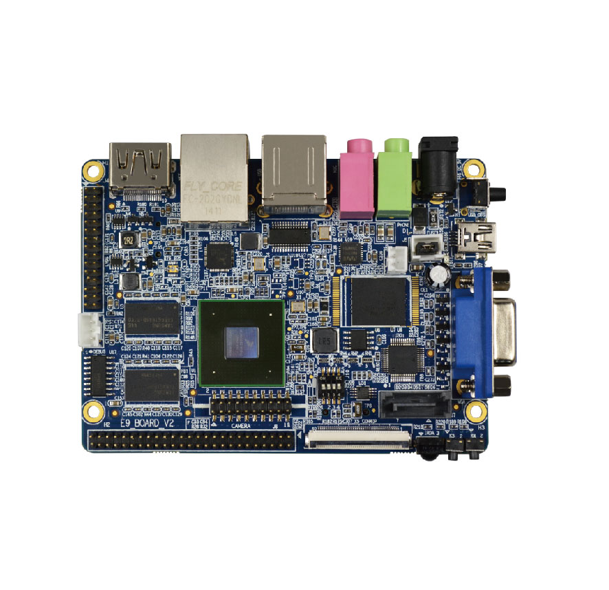
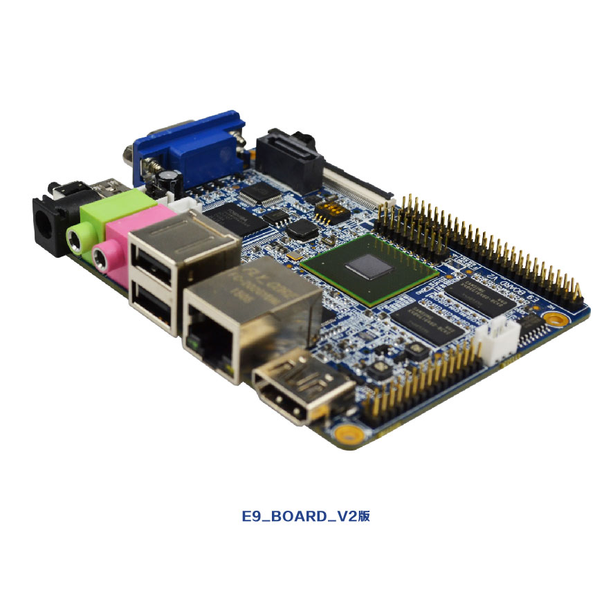
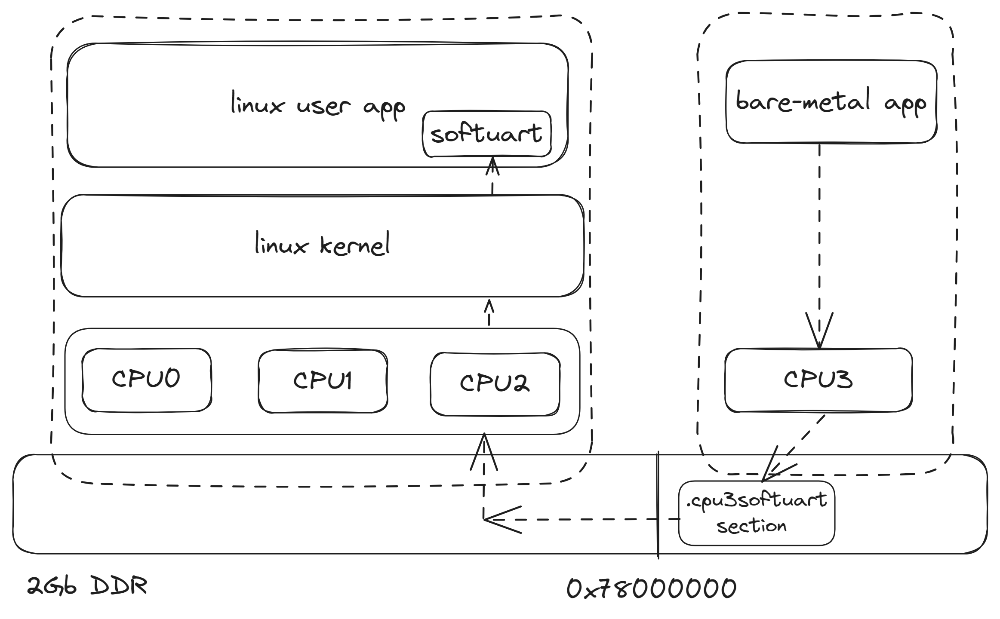

# imx6q amp

### Project Title
imx6q amp simplified version    

 **Linux on cpu0-cpu2  
ThreadX applications on cpu3**    

### Development platform:  
 Raspberry Pi 4B   
### Software development tools:  
 arm-none-eabi-gcc gcc version 12.3.1 20230626 (Arm GNU Toolchain 12.3.Rel1 (Build arm-12.35))    
 arm-none-linux-gnueabihf-gcc gcc version 12.3.1 20230626 (Arm GNU Toolchain 12.3.Rel1 (Build arm-12.35))   
### Reference Documents:  
 <<i.MX 6Dual/6Quad Applications Processor Reference Manual>>   
### Reference code:  
 iMX6_Platform_SDK  
### Development board:  



### Software architecture



### Test
```
[root@imx6q /usr/local/app]# ls
SW_APP.out    cpu3_app.elf
[root@imx6q /usr/local/app]# ./SW_APP.out &
[root@imx6q /usr/local/app]# 
App start ...
Build Time:Jan 19 2025-12:39:46.
load /usr/local/app/cpu3_app.elf to Stream buf , size 4673932. 
Loading ELF headering
Loading ELF program headering
Loading ELF section header.
Loading ELF shstrtab.
/usr/local/app/cpu3_app.elf convert to bin success, bin size 4440064. 
save /usr/local/app/cpu3_app.bin bin success, bin size 4440064. 
load cpu3 elf app success , size 4440064. 
cpu3 entry addr:0x78000440,entry arg:0x7801aa20 
cpu3 power on 
cpu3 soft uart addr:0x78035000
cpu3 soft uart vir addr: 0xb644c000 
softuart thread start ...
[-CPU3-]:main-(00045)]Build Time:Jan 25 2025-09:59:22.
[-CPU3-]:main-(00046)]float test pi = 3.141593
[-CPU3-]:main-(00047)]process debug addr:0x78034458
[-CPU3-]:main-(00050)]cpsr reg = 0x400001d3
[-CPU3-]:main-(00052)]vbar reg = 0x78000440
[-CPU3-]:disp_scu_all_regs-(00030)]SCU_Control_Register = 0x00000021
[-CPU3-]:disp_scu_all_regs-(00032)]SCU_Configuration_Register = 0x00005573
[-CPU3-]:disp_scu_all_regs-(00034)]SCU_CPU_Power_Status_Register = 0x00000000
[-CPU3-]:disp_scu_all_regs-(00036)]SCU_Invalidate_All_Registers_in_Secure_State = 0x00000000
[-CPU3-]:disp_scu_all_regs-(00038)]Filtering_Start_Address_Register = 0x00000000
[-CPU3-]:disp_scu_all_regs-(00040)]Filtering_End_Address_Register = 0x00000000
[-CPU3-]:disp_scu_all_regs-(00042)]SCU_Access_Control_Register = 0x0000000f
[-CPU3-]:disp_scu_all_regs-(00044)]SCU_Non-secure_Access_Control_Register = 0x00000000
[-CPU3-]:mmu_table_init-(00273)]38 Items translation table init done 
[-CPU3-]:main-(00077)]Enable MMU 
[-CPU3-]:main-(00080)]Enable SIMD VFP 
[-CPU3-]:main-(00083)]Neon Test ...
I:  7298-Q: -8657|I: 28513-Q:  7192|I:-14294-Q:  4935|I:  3797-Q: 25403|I:-13302-Q: 18999|I: 17846-Q:-31606|I:  3377-Q: -1452|I:   690-Q: 10603|I: -2352-Q:-20951|I:-24549-Q:   521|I:  8485-Q:  2026|I:-10757-Q: 30099|I:  5764-Q:  1393|I: -1091-Q:  5758|I: 
[-CPU3-]:TestNeon-(00059)]C Intrinsics done 
I:  7298-Q: -8657|I: 28513-Q:  7192|I:-14294-Q:  4935|I:  3797-Q: 25403|I:-13302-Q: 18999|I: 17846-Q:-31606|I:  3377-Q: -1452|I:   690-Q: 10603|I: -2352-Q:-20951|I:-24549-Q:   521|I:  8485-Q:  2026|I:-10757-Q: 30099|I:  5764-Q:  1393|I: -1091-Q:  5758|I: 
[-CPU3-]:TestNeon-(00095)]NEON Intrinsics done 
[-CPU3-]:TestNeon-(00096)]int convert to  short test 
[-CPU3-]:TestNeon-(00097)]RAW Data: 
25791 531569 -2334455 -11515 
[-CPU3-]:TestNeon-(00103)]C: 
25791 7281 24841 -11515 
[-CPU3-]:TestNeon-(00110)]NEON:
25791 7281 24841 -11515 
[-CPU3-]:TestNeon-(00118)]NEON saturated:
25791 32767 -32768 -11515 
[-CPU3-]:main-(00085)]Normal Distribution Random number Test ...
    2.8997211   -0.9088573    0.2041950   -0.2572155   -0.8516827    0.7996998   -0.9866619    0.0431385   -1.9194927    0.2543507
   -0.3689251    1.2145863   -1.0537090    1.7050953   -1.6925945   -0.4928722    1.9956684   -0.5980663    1.2923298    0.1707630
   -0.5213604   -0.4051342    0.8358479   -0.5445080    1.6452045    0.5338917   -0.8120403   -0.3886852   -0.2546368    0.4690113
   -0.4013348   -0.1117687   -0.9708843    0.6502247    1.3179646    0.5362415    0.7464619    1.3275318   -0.4041424    1.8053455
   -0.8525982   -0.2490673    1.6823444    0.9455433    0.4819355    1.1704273   -0.1725750    0.2068348   -1.9999371    0.8360157
[-CPU3-]:application_main-(00061)]ThreadX Version:06.04.00.
[-CPU3-]:thread_0_entry-(00191)]**** ThreadX Demonstration on NXP i.MX 6Quad **** 

           Thread 0 Counter:            0x00000001
           Thread 1 Counter:            0x00000000
           Thread 2 Counter:            0x00000000
           Thread 3 Counter:            0x00000000
           Thread 4 Counter:            0x00000000
           Thread 5 Counter:            0x00000000
           Thread 6 Counter:            0x00000000
           Thread 7 Counter:            0x00000000

[-CPU3-]:thread_0_entry-(00191)]**** ThreadX Demonstration on NXP i.MX 6Quad **** 

           Thread 0 Counter:            0x00000002
           Thread 1 Counter:            0x0022aacb
           Thread 2 Counter:            0x0022aaa0
           Thread 3 Counter:            0x000000fb
           Thread 4 Counter:            0x000000fa
           Thread 5 Counter:            0x00000001
           Thread 6 Counter:            0x000000fb
           Thread 7 Counter:            0x000000fa

[-CPU3-]:thread_0_entry-(00191)]**** ThreadX Demonstration on NXP i.MX 6Quad **** 

           Thread 0 Counter:            0x00000003
           Thread 1 Counter:            0x0045592d
           Thread 2 Counter:            0x004558ee
           Thread 3 Counter:            0x000001f5
           Thread 4 Counter:            0x000001f4
           Thread 5 Counter:            0x00000002
           Thread 6 Counter:            0x000001f5
           Thread 7 Counter:            0x000001f4

[-CPU3-]:thread_0_entry-(00191)]**** ThreadX Demonstration on NXP i.MX 6Quad **** 

           Thread 0 Counter:            0x00000004
           Thread 1 Counter:            0x006807ca
           Thread 2 Counter:            0x00680790
           Thread 3 Counter:            0x000002ef
           Thread 4 Counter:            0x000002ee
           Thread 5 Counter:            0x00000003
           Thread 6 Counter:            0x000002ef
           Thread 7 Counter:            0x000002ee

[-CPU3-]:thread_0_entry-(00191)]**** ThreadX Demonstration on NXP i.MX 6Quad **** 

           Thread 0 Counter:            0x00000005
           Thread 1 Counter:            0x008ab621
           Thread 2 Counter:            0x008ab5f2
           Thread 3 Counter:            0x000003e9
           Thread 4 Counter:            0x000003e8
           Thread 5 Counter:            0x00000004
           Thread 6 Counter:            0x000003e9
           Thread 7 Counter:            0x000003e8

[-CPU3-]:thread_0_entry-(00191)]**** ThreadX Demonstration on NXP i.MX 6Quad **** 

           Thread 0 Counter:            0x00000006
           Thread 1 Counter:            0x00ad64b9
           Thread 2 Counter:            0x00ad6469
           Thread 3 Counter:            0x000004e3
           Thread 4 Counter:            0x000004e2
           Thread 5 Counter:            0x00000005
           Thread 6 Counter:            0x000004e3
           Thread 7 Counter:            0x000004e2

[-CPU3-]:thread_0_entry-(00191)]**** ThreadX Demonstration on NXP i.MX 6Quad **** 

           Thread 0 Counter:            0x00000007
           Thread 1 Counter:            0x00d0131d
           Thread 2 Counter:            0x00d0131c
           Thread 3 Counter:            0x000005dd
           Thread 4 Counter:            0x000005dc
           Thread 5 Counter:            0x00000006
           Thread 6 Counter:            0x000005dd
           Thread 7 Counter:            0x000005dc

[-CPU3-]:thread_0_entry-(00191)]**** ThreadX Demonstration on NXP i.MX 6Quad **** 

           Thread 0 Counter:            0x00000008
           Thread 1 Counter:            0x00f2c17d
           Thread 2 Counter:            0x00f2c16f
           Thread 3 Counter:            0x000006d7
           Thread 4 Counter:            0x000006d6
           Thread 5 Counter:            0x00000007
           Thread 6 Counter:            0x000006d7
           Thread 7 Counter:            0x000006d6

```

#### 参与贡献

1.  Fork 本仓库
2.  新建 Feat_xxx 分支
3.  提交代码
4.  新建 Pull Request


#### 特技

1.  使用 Readme\_XXX.md 来支持不同的语言，例如 Readme\_en.md, Readme\_zh.md
2.  Gitee 官方博客 [blog.gitee.com](https://blog.gitee.com)
3.  你可以 [https://gitee.com/explore](https://gitee.com/explore) 这个地址来了解 Gitee 上的优秀开源项目
4.  [GVP](https://gitee.com/gvp) 全称是 Gitee 最有价值开源项目，是综合评定出的优秀开源项目
5.  Gitee 官方提供的使用手册 [https://gitee.com/help](https://gitee.com/help)
6.  Gitee 封面人物是一档用来展示 Gitee 会员风采的栏目 [https://gitee.com/gitee-stars/](https://gitee.com/gitee-stars/)
