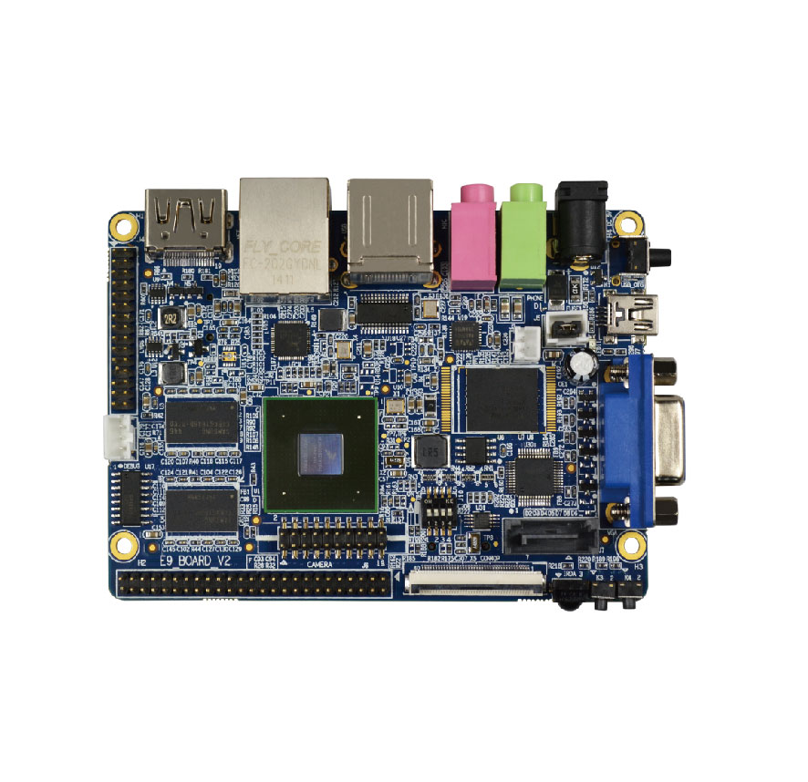
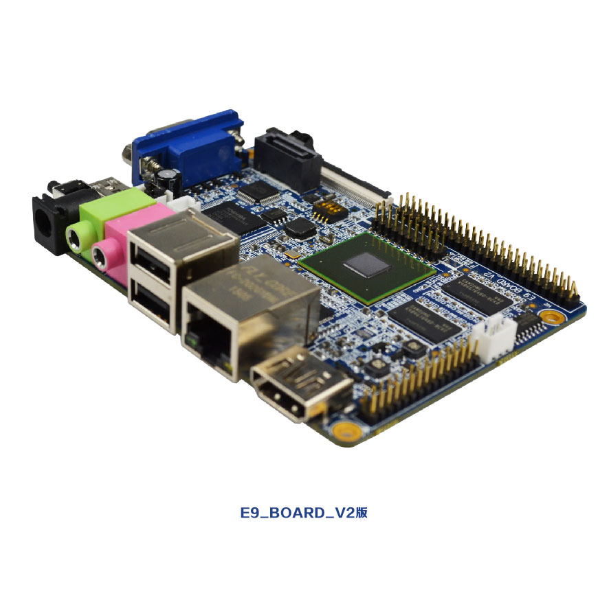
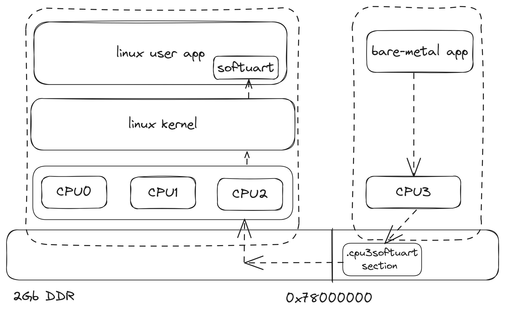
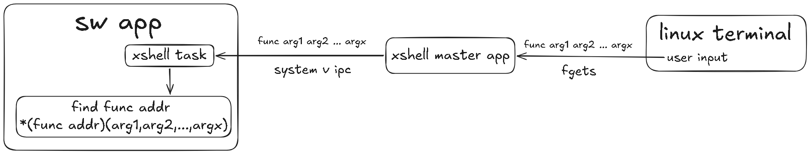
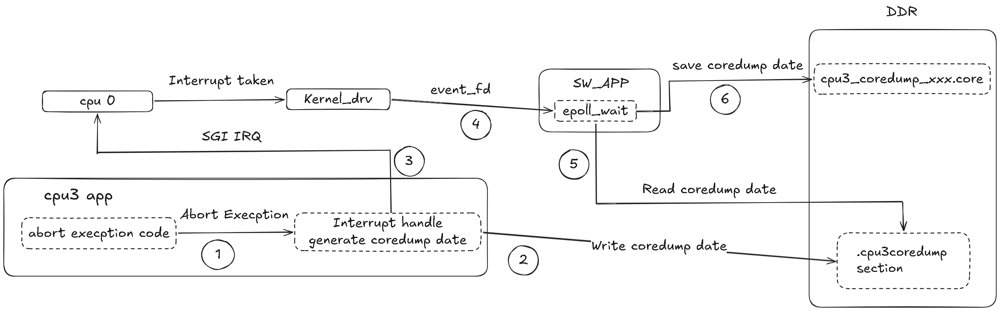

# imx6q amp

### Project Title
imx6q amp,just for fun   
### core function:
- 1 Linux 6.5.0 runs on CPU0~CPU2, ThreadX applications or  bare-metal applications on CPU3.   
- 2 Linux loads ELF firmware to boot CPU3. Virtual UART based on shared memory forwards CPU3 logs to Linux console.   
- 3 Linux xshell debugging tool. interactive command-line interface supporting remote function calls for target processes during runtime.   
- 4 Bare-metal on CPU3 performs stack backtrace, and Linux script parses symbol addresses to resolve function names. 
- 5 When an Abort exception is triggered on CPU3, a coredump file is generated and stored in DDR. An SGI interrupt is then asserted to notify CPU0 to read the file for subsequent analysis with GDB.    

### Development platform:  
 Raspberry Pi 4B / Ubuntu 24.04 VM    
### Software development tools:  
 arm-none-eabi-gcc gcc version 12.3.1 20230626 (Arm GNU Toolchain 12.3.Rel1 (Build arm-12.35))    
 arm-none-linux-gnueabihf-gcc gcc version 12.3.1 20230626 (Arm GNU Toolchain 12.3.Rel1 (Build arm-12.35))   
### Reference Documents:  
 <<i.MX 6Dual/6Quad Applications Processor Reference Manual>>   
### Reference code:  
```css
 iMX6_Platform_SDK     
 https://github.com/antirez/linenoise
 https://github.com/eclipse-threadx/threadx
 https://github.com/OP-TEE/optee_os
 https://github.com/rockchip-linux/u-boot
 https://github.com/apache/nuttx
```
### Development board:  



### Software architecture



## amp ctrl  
### Test
```c
[root@imx6q /usr/local/app]# ls
SW_APP.out    cpu3_app.elf
[root@imx6q /usr/local/app]# ./SW_APP.out &
[root@imx6q /usr/local/app]# 
App start ...
Build Time:Jan 19 2025-12:39:46.
load /usr/local/app/cpu3_app.elf to Stream buf , size 4673932. 
Loading ELF headering
Loading ELF program headering
Loading ELF section header.
Loading ELF shstrtab.
/usr/local/app/cpu3_app.elf convert to bin success, bin size 4440064. 
save /usr/local/app/cpu3_app.bin bin success, bin size 4440064. 
load cpu3 elf app success , size 4440064. 
cpu3 entry addr:0x78000440,entry arg:0x7801aa20 
cpu3 power on 
cpu3 soft uart addr:0x78035000
cpu3 soft uart vir addr: 0xb644c000 
softuart thread start ...
[-CPU3-]:main-(00045)]Build Time:Jan 25 2025-09:59:22.
[-CPU3-]:main-(00046)]float test pi = 3.141593
[-CPU3-]:main-(00047)]process debug addr:0x78034458
[-CPU3-]:main-(00050)]cpsr reg = 0x400001d3
[-CPU3-]:main-(00052)]vbar reg = 0x78000440
[-CPU3-]:disp_scu_all_regs-(00030)]SCU_Control_Register = 0x00000021
[-CPU3-]:disp_scu_all_regs-(00032)]SCU_Configuration_Register = 0x00005573
[-CPU3-]:disp_scu_all_regs-(00034)]SCU_CPU_Power_Status_Register = 0x00000000
[-CPU3-]:disp_scu_all_regs-(00036)]SCU_Invalidate_All_Registers_in_Secure_State = 0x00000000
[-CPU3-]:disp_scu_all_regs-(00038)]Filtering_Start_Address_Register = 0x00000000
[-CPU3-]:disp_scu_all_regs-(00040)]Filtering_End_Address_Register = 0x00000000
[-CPU3-]:disp_scu_all_regs-(00042)]SCU_Access_Control_Register = 0x0000000f
[-CPU3-]:disp_scu_all_regs-(00044)]SCU_Non-secure_Access_Control_Register = 0x00000000
[-CPU3-]:mmu_table_init-(00273)]38 Items translation table init done 
[-CPU3-]:main-(00077)]Enable MMU 
[-CPU3-]:main-(00080)]Enable SIMD VFP 
[-CPU3-]:main-(00083)]Neon Test ...
I:  7298-Q: -8657|I: 28513-Q:  7192|I:-14294-Q:  4935|I:  3797-Q: 25403|I:-13302-Q: 18999|I: 17846-Q:-31606|I:  3377-Q: -1452|I:   690-Q: 10603|I: -2352-Q:-20951|I:-24549-Q:   521|I:  8485-Q:  2026|I:-10757-Q: 30099|I:  5764-Q:  1393|I: -1091-Q:  5758|I: 
[-CPU3-]:TestNeon-(00059)]C Intrinsics done 
I:  7298-Q: -8657|I: 28513-Q:  7192|I:-14294-Q:  4935|I:  3797-Q: 25403|I:-13302-Q: 18999|I: 17846-Q:-31606|I:  3377-Q: -1452|I:   690-Q: 10603|I: -2352-Q:-20951|I:-24549-Q:   521|I:  8485-Q:  2026|I:-10757-Q: 30099|I:  5764-Q:  1393|I: -1091-Q:  5758|I: 
[-CPU3-]:TestNeon-(00095)]NEON Intrinsics done 
[-CPU3-]:TestNeon-(00096)]int convert to  short test 
[-CPU3-]:TestNeon-(00097)]RAW Data: 
25791 531569 -2334455 -11515 
[-CPU3-]:TestNeon-(00103)]C: 
25791 7281 24841 -11515 
[-CPU3-]:TestNeon-(00110)]NEON:
25791 7281 24841 -11515 
[-CPU3-]:TestNeon-(00118)]NEON saturated:
25791 32767 -32768 -11515 
[-CPU3-]:main-(00085)]Normal Distribution Random number Test ...
    2.8997211   -0.9088573    0.2041950   -0.2572155   -0.8516827    0.7996998   -0.9866619    0.0431385   -1.9194927    0.2543507
   -0.3689251    1.2145863   -1.0537090    1.7050953   -1.6925945   -0.4928722    1.9956684   -0.5980663    1.2923298    0.1707630
   -0.5213604   -0.4051342    0.8358479   -0.5445080    1.6452045    0.5338917   -0.8120403   -0.3886852   -0.2546368    0.4690113
   -0.4013348   -0.1117687   -0.9708843    0.6502247    1.3179646    0.5362415    0.7464619    1.3275318   -0.4041424    1.8053455
   -0.8525982   -0.2490673    1.6823444    0.9455433    0.4819355    1.1704273   -0.1725750    0.2068348   -1.9999371    0.8360157
[-CPU3-]:application_main-(00061)]ThreadX Version:06.04.00.
[-CPU3-]:thread_0_entry-(00191)]**** ThreadX Demonstration on NXP i.MX 6Quad **** 

           Thread 0 Counter:            0x00000001
           Thread 1 Counter:            0x00000000
           Thread 2 Counter:            0x00000000
           Thread 3 Counter:            0x00000000
           Thread 4 Counter:            0x00000000
           Thread 5 Counter:            0x00000000
           Thread 6 Counter:            0x00000000
           Thread 7 Counter:            0x00000000

[-CPU3-]:thread_0_entry-(00191)]**** ThreadX Demonstration on NXP i.MX 6Quad **** 

           Thread 0 Counter:            0x00000002
           Thread 1 Counter:            0x0022aacb
           Thread 2 Counter:            0x0022aaa0
           Thread 3 Counter:            0x000000fb
           Thread 4 Counter:            0x000000fa
           Thread 5 Counter:            0x00000001
           Thread 6 Counter:            0x000000fb
           Thread 7 Counter:            0x000000fa

[-CPU3-]:thread_0_entry-(00191)]**** ThreadX Demonstration on NXP i.MX 6Quad **** 

           Thread 0 Counter:            0x00000003
           Thread 1 Counter:            0x0045592d
           Thread 2 Counter:            0x004558ee
           Thread 3 Counter:            0x000001f5
           Thread 4 Counter:            0x000001f4
           Thread 5 Counter:            0x00000002
           Thread 6 Counter:            0x000001f5
           Thread 7 Counter:            0x000001f4

```
## xshell debug tools 
### Software architecture   
    

### Test    
```c
[root@imx6q /mnt/emmc]# [  287.472044] imx6q-amp imx6q_amp: virq sgi 289 kick cpu:0
[-CPU3-]:main-(00092)][  287.477420] imx6q-amp imx6q_amp: work executed on CPU 0
run times:0x00000016.
[root@imx6q /mnt/emmc]# xshell.out 
Current tty: /dev/ttymxc0
APP tty is redirect to /dev/ttymxc0
xshell>>
xshell>>Cpu3ElfHeader_Show
ELF Header:
  Magic:   7f 45 4c 46 01 01 01 00 00 00 00 00 00 00 00 00 
  Class:                             ELF32
  Data:                              2's complement, little endian
  Version:                           1 (current)
  OS/ABI:                            UNIX - System V
  ABI Version:                       0
  Type:                              EXEC (Executable file)
  Machine:                           ARM
  Version:                           0x1
  Entry point address:               0x78000440
  Start of program headers:          52 (bytes into file)
  Start of section headers:          4673036 (bytes into file)
  Size of this header:               52 (bytes)
  Size of program headers:           32 (bytes)
  Number of program headers:         4  Size of section headers:           40 (bytes)
  Number of section headers:         31
  Section header string table index: 30
Section Headers:
  [Nr]  Name             Type             Addr       Off        Size       ES   Flg Lk Inf Al
  [ 0]                   NULL             0x00000000 0x00000000 0x00000000 0x00
  [ 1] .ivt              PROGBITS         0x78000000 0x00001000 0x00000420 0x00
  [ 2] .boot_data        PROGBITS         0x78000420 0x00001420 0x0000000c 0x00
  [ 3] .dcd_hdr          PROGBITS         0x78000430 0x00001430 0x00000004 0x00
  [ 4] .dcd_wrt_cmd      PROGBITS         0x78000434 0x00001434 0x00000004 0x00
  [ 5] .text             PROGBITS         0x78000438 0x00001438 0x0001a6e0 0x00
  [ 6] .cpu3main         PROGBITS         0x7801ab18 0x0001bb18 0x00000328 0x00
  [ 7] .rodata           PROGBITS         0x7801ae40 0x0001be40 0x00001724 0x00
  [ 8] .eh_frame         PROGBITS         0x7801c564 0x0001d564 0x00000028 0x00
  [ 9] .ARM.exidx        ARM_EXIDX        0x7801c58c 0x0001d58c 0x00000008 0x00
  [10] .data             PROGBITS         0x7801c598 0x0001d598 0x00018aec 0x00
  [11] .cpu3softuart     PROGBITS         0x78036000 0x00037000 0x00000008 0x00
  [12] .mmu_l1_table     PROGBITS         0x78038000 0x00038000 0x00004000 0x00
  [13] .mmu_l2_table     PROGBITS         0x7803c000 0x0003c000 0x00400000 0x00
  [14] .hab.data         NOBITS           0x78a00000 0x0043c000 0x00002000 0x00
  [15] .bss              NOBITS           0x78a02000 0x0043c000 0x000095d8 0x00
  [16] .heap             NOBITS           0x78a0b5d8 0x0043c000 0x01000000 0x00
  [17] .stacks           NOBITS           0x79a0b5d8 0x0043c000 0x00a02808 0x00
  [18] .ARM.attributes   ARM_ATTRIBUTES   0x00000000 0x0043c000 0x00000035 0x00
  [19] .comment          PROGBITS         0x00000000 0x0043c035 0x00000044 0x01
  [20] .debug_info       PROGBITS         0x00000000 0x0043c079 0x00019073 0x00
  [21] .debug_abbrev     PROGBITS         0x00000000 0x004550ec 0x000056bc 0x00
  [22] .debug_aranges    PROGBITS         0x00000000 0x0045a7a8 0x00000ac0 0x00
  [23] .debug_line       PROGBITS         0x00000000 0x0045b268 0x000094a3 0x00
  [24] .debug_str        PROGBITS         0x00000000 0x0046470b 0x00003f81 0x01
  [25] .debug_frame      PROGBITS         0x00000000 0x0046868c 0x00003a2c 0x00
  [26] .debug_rnglists   PROGBITS         0x00000000 0x0046c0b8 0x00000034 0x00
  [27] .debug_line_str   PROGBITS         0x00000000 0x0046c0ec 0x000002be 0x01
  [28] .symtab           SYMTAB           0x00000000 0x0046c3ac 0x00005910 0x10
  [29] .strtab           STRTAB           0x00000000 0x00471cbc 0x00003013 0x00
  [30] .shstrtab         STRTAB           0x00000000 0x00474ccf 0x0000013b 0x00

Program Headers:
  Type           Offset   VirtAddr   PhysAddr   FileSiz MemSiz  Flg Align
  EXIDX          0x01d58c 0x7801c58c 0x7801c58c 0x00008 0x00008 R   0x4
  LOAD           0x001000 0x78000000 0x78000000 0x36008 0x36008 RWE 0x1000
  LOAD           0x038000 0x78038000 0x78038000 0x404000 0x404000 RW  0x4000
  LOAD           0x000000 0x78a00000 0x78a00000 0x00000 0x1a0dde0 RW  0x1000
addr:0x00016081.
xshell>>
xshell>>exit
exit xshell !
[root@imx6q /mnt/emmc]# 
```
## cpu3 dump stack(NO RTOS)

### Test 
```c
[-CPU3-]:Test_dump_stack-(00649)]=== Complex Nesting Test for dump_stack ===
[-CPU3-]:Test_dump_stack-(00650)]Call chain: main -> wrapper -> func1 -> func2 -> func3 -> func4 -> func5 -> func6 -> recursive_func x3
[-CPU3-]:Test_dump_stack-(00651)]After reaching base case of recursion, dump_stack() will be called.
[-CPU3-]:wrapper_func-(00641)]
[-CPU3-]:wrapper_func-(00642)]--- Enter wrapper_func, about to call function pointer ---
[-CPU3-]:func1-(00634)]func1 start_level=1
[-CPU3-]:func2-(00624)]func2: ->func1[level=2]
[-CPU3-]:func3-(00610)]func3 level=3
[-CPU3-]:func4-(00601)]func4: Hello from func3 at level 4, magic=0xDEADBEEF
[-CPU3-]:func5-(00591)]func5 level=5, data=7.92
[-CPU3-]:func6-(00577)]func6 level=6 called, local=600, temp=23.76
[-CPU3-]:recursive_func-(00565)]recursive_func: depth=3, calling recursively...
[-CPU3-]:recursive_func-(00565)]recursive_func: depth=2, calling recursively...
[-CPU3-]:recursive_func-(00565)]recursive_func: depth=1, calling recursively...
[-CPU3-]:recursive_func-(00556)]
[-CPU3-]:recursive_func-(00557)]>>> Reached base case of recursion (depth = 0) <<<
[-CPU3-]:recursive_func-(00558)]>>> Current stack should contain main -> func1 -> ... -> func6 -> recursive_func x 3 <<<
[-CPU3-]:dump_stack-(00518)]Stack:0x79a0c5e0-0x7a40c5e0
[-CPU3-]:print_stack_arm32-(00470)]
[-CPU3-]:print_stack_arm32-(00471)]Call trace:
[-CPU3-]:print_stack_arm32-(00472)]  PC:        [< 7800690c >]
[-CPU3-]:print_stack_arm32-(00473)]  LR:        [< 78006930 >]
[-CPU3-]:print_stack_arm32-(00474)]
[-CPU3-]:print_stack_arm32-(00475)]Stack:
[-CPU3-]:print_stack_arm32-(00479)]     [< 78006910 >]
[-CPU3-]:print_stack_arm32-(00479)]     [< 78006c44 >]
[-CPU3-]:print_stack_arm32-(00479)]     [< 78006ca4 >]
[-CPU3-]:print_stack_arm32-(00479)]     [< 78006ca4 >]
[-CPU3-]:print_stack_arm32-(00479)]     [< 78006ca4 >]
[-CPU3-]:print_stack_arm32-(00479)]     [< 78006d4c >]
[-CPU3-]:print_stack_arm32-(00479)]     [< 78006e8c >]
[-CPU3-]:print_stack_arm32-(00479)]     [< 78006f3c >]
[-CPU3-]:print_stack_arm32-(00479)]     [< 7800701c >]
[-CPU3-]:print_stack_arm32-(00479)]     [< 780070c8 >]
[-CPU3-]:print_stack_arm32-(00479)]     [< 78007164 >]
[-CPU3-]:print_stack_arm32-(00479)]     [< 780071f4 >]
[-CPU3-]:print_stack_arm32-(00479)]     [< 780072e8 >]
[-CPU3-]:print_stack_arm32-(00479)]     [< 78023e88 >]
[-CPU3-]:print_stack_arm32-(00479)]     [< 7800058c >]
[-CPU3-]:print_stack_arm32-(00482)]
Copy info from "Call trace..." to a file(eg. dump.txt)
and run command in your project: ./scripts/stacktrace.sh dump.txt
[-CPU3-]:wrapper_func-(00644)]--- wrapper_func finished ---
[-CPU3-]:Test_dump_stack-(00656)]
[-CPU3-]:Test_dump_stack-(00657)]=== End of test ===
[-CPU3-]:main-(00094)]tick:0 s:387141000 ns

```
Run the parsing script:  
```c
linux@linux-VMware-Virtual-Platform:~/workspace/imx6q_amp/cpu3_app/scripts$ ./stacktrace.sh dump.txt

SYMBOL File: cpu3_app.sym

Call trace:
 PC:        [< 7800690c >]  dump_stack+0x0/0x16c      imx6q_amp/cpu3_app/apps/src/debug/stacktrace_unwind_arm32.c:488
 LR:        [< 78006930 >]  dump_stack+0x24/0x16c      imx6q_amp/cpu3_app/apps/src/debug/stacktrace_unwind_arm32.c:490

Stack:
       [< 78006910 >]  dump_stack+0x4/0x16c
       [< 78006c44 >]  recursive_func+0x1cc/0x234
       [< 78006ca4 >]  recursive_func+0x22c/0x234
       [< 78006ca4 >]  recursive_func+0x22c/0x234
       [< 78006ca4 >]  recursive_func+0x22c/0x234
       [< 78006d4c >]  func6+0xa0/0xac
       [< 78006e8c >]  func5+0x134/0x140
       [< 78006f3c >]  func4+0xa4/0xb8
       [< 7800701c >]  func3+0xcc/0xe0
       [< 780070c8 >]  func2+0x98/0xb0
       [< 78007164 >]  func1+0x84/0x90
       [< 780071f4 >]  wrapper_func+0x84/0xc0
       [< 780072e8 >]  Test_dump_stack+0xb8/0x124
       [< 78023e88 >]  main+0x2d0/0x338
       [< 7800058c >]  _boot+0x104/0x0

linux@linux-VMware-Virtual-Platform:~/workspace/imx6q_amp/cpu3_app/scripts$
```
## cpu3 coredump(NO RTOS)
### Software architecture   
  
### Test 
```c
[-CPU3-]:recursive_func-(00558)]>>> Reached base case of recursion (depth = 0) <<<
[-CPU3-]:recursive_func-(00559)]>>> Current stack should contain main -> func1 -> ... -> func6 -> recursive_func x 3 <<<

Oops, data abort occurred!

Registers at point of exception:
cpsr = nZcvqeAiFt Supervisor (0x40000153)
r0 = 0x00000084    r8 =  0x00000000
r1 = 0x78a0b6cc    r9 =  0x00000000
r2 = 0x00000000    r10 = 0x00000000
r3 = 0x12345678    r11 = 0x7a40b8ec
r4 = 0x780041b0    r12 = 0x7a40b8f0
r5 = 0x00000000    sp =  0x7a40b8e0
r6 = 0x00000000    lr =  0x78006220
r7 = 0x00000000    pc =  0x7800600c
dfsr = 0x0000080f
dfar = 0x00000000

Access type: write
Fault status: 0xf
[-CPU3-]:dump_stack_isr-(00556)]Stack:0x79a0c630-0x7a40c630
[-CPU3-]:dump_stack_isr-(00559)]
[-CPU3-]:dump_stack_isr-(00560)]Call trace:
[-CPU3-]:dump_stack_isr-(00561)]  PC:    [< 7800600c >]
[-CPU3-]:dump_stack_isr-(00562)]  LR:    [< 78006220 >]
[-CPU3-]:dump_stack_isr-(00563)]
[-CPU3-]:dump_stack_isr-(00564)]Stack:
[-CPU3-]:dump_stack_isr-(00568)]    [< 7800600c >]
[-CPU3-]:dump_stack_isr-(00568)]    [< 78006220 >]
[-CPU3-]:dump_stack_isr-(00568)]    [< 78006284 >]
[-CPU3-]:dump_stack_isr-(00568)]    [< 78006284 >]
[-CPU3-]:dump_stack_isr-(00568)]    [< 78006284 >]
[-CPU3-]:dump_stack_isr-(00568)]    [< 7800632c >]
[-CPU3-]:dump_stack_isr-(00568)]    [< 7800646c >]
[-CPU3-]:dump_stack_isr-(00568)]    [< 7800651c >]
[-CPU3-]:dump_stack_isr-(00568)]    [< 780065fc >]
[-CPU3-]:dump_stack_isr-(00568)]    [< 780066a8 >]
[-CPU3-]:dump_stack_isr-(00568)]    [< 78006744 >]
[-CPU3-]:dump_stack_isr-(00568)]    [< 780067d4 >]
[-CPU3-]:dump_stack_isr-(00568)]    [< 780068c8 >]
[-CPU3-]:dump_stack_isr-(00568)]    [< 780044bc >]
[-CPU3-]:dump_stack_isr-(00568)]    [< 7800058c >]
[-CPU3-]:dump_stack_isr-(00571)]
Copy info from "Call trace..." to a file(eg. dump.txt)
and run command in your project: ./scripts/stacktrace.sh dump.txt
coredump eventfd triggered (count=1)
cpu3 core dump addr:0x7a40e000
CPU3 Core Dump VirtAddr:0xb06fe000 ,uloffset:0x0,ulPhyBase:0x7a40e000,PAGE_CNT:5121
Starting memory dump to /usr/local/app/cpu3_coredump_19700101_101737.core (size: 8256 bytes)
Memory dump completed successfully: /usr/local/app/cpu3_coredump_19700101_101737.core

[root@imx6q /usr/local/app]#
[root@imx6q /usr/local/app]# ls
PKG_20260613_172714.tar             cpu3_app.elf
SW_APP.out                          cpu3_coredump_19700101_101737.core
SymTbl.txt                          emmc_image_update.sh
amp_sgi.ko                          emmc_partition.sh
[root@imx6q /usr/local/app]#
[root@imx6q /usr/local/app]#
[root@imx6q /usr/local/app]# gdb  cpu3_app.elf cpu3_coredump_19700101_101737.core
GNU gdb (GDB) 13.2
Copyright (C) 2023 Free Software Foundation, Inc.
License GPLv3+: GNU GPL version 3 or later <http://gnu.org/licenses/gpl.html>
This is free software: you are free to change and redistribute it.
There is NO WARRANTY, to the extent permitted by law.
Type "show copying" and "show warranty" for details.
This GDB was configured as "arm-none-linux-gnueabihf".
Type "show configuration" for configuration details.
For bug reporting instructions, please see:
<https://www.gnu.org/software/gdb/bugs/>.
Find the GDB manual and other documentation resources online at:
    <http://www.gnu.org/software/gdb/documentation/>.

For help, type "help".
Type "apropos word" to search for commands related to "word"...
Reading symbols from cpu3_app.elf...

warning: could not convert 'main' from the host encoding (ANSI_X3.4-1968) to UTF-32.
This normally should not happen, please file a bug report.

warning: core file may not match specified executable file.
[New LWP 1]
Core was generated by `'.
#0  0x7800600c in data_abort_test () at apps/src/debug/coredump.c:509
509     apps/src/debug/coredump.c: No such file or directory.
(gdb) info thread
  Id   Target Id         Frame
* 1    LWP 1             0x7800600c in data_abort_test ()
    at apps/src/debug/coredump.c:509
(gdb) info reg
r0             0x84                132
r1             0x78a0b6cc          2023798476
r2             0x0                 0
r3             0x12345678          305419896
r4             0x780041b0          2013282736
r5             0x0                 0
r6             0x0                 0
r7             0x0                 0
r8             0x0                 0
r9             0x0                 0
r10            0x0                 0
r11            0x7a40b8ec          2051061996
r12            0x7a40b8f0          2051062000
sp             0x7a40b8e0          0x7a40b8e0
lr             0x78006220          2013291040
pc             0x7800600c          0x7800600c <data_abort_test+32>
cpsr           0x40000153          1073742163
(gdb) bt
#0  0x7800600c in data_abort_test () at apps/src/debug/coredump.c:509
#1  0x78006220 in recursive_func (depth=0, max_depth=3)
    at apps/src/debug/coredump.c:561
#2  0x78006284 in recursive_func (depth=1, max_depth=3)
    at apps/src/debug/coredump.c:569
#3  0x78006284 in recursive_func (depth=2, max_depth=3)
    at apps/src/debug/coredump.c:569
#4  0x78006284 in recursive_func (depth=3, max_depth=3)
    at apps/src/debug/coredump.c:569
#5  0x7800632c in func6 (level=6, data=11.8806176063304,
    tag=0x7802602c "from_func5") at apps/src/debug/coredump.c:583
#6  0x7800646c in func5 (level=5, data=7.9204117375536001)
    at apps/src/debug/coredump.c:595
#7  0x7800651c in func4 (level=4, data=6.6003431146280001,
    msg=0x780260d0 "Hello from func3") at apps/src/debug/coredump.c:605
#8  0x780065fc in func3 (level=3, data=6.2800000000000002)
    at apps/src/debug/coredump.c:619
#9  0x780066a8 in func2 (level=2, prefix=0x78026158 "->func1")
    at apps/src/debug/coredump.c:628
#10 0x78006744 in func1 (start_level=1) at apps/src/debug/coredump.c:638
#11 0x780067d4 in wrapper_func (fn=0x780066c0 <func1>, arg=1)
    at apps/src/debug/coredump.c:646
#12 0x780068c8 in Test_coredump () at apps/src/debug/coredump.c:658
--Type <RET> for more, q to quit, c to continue without paging--
#13 0x780044bc in cpu3_main () at apps/src/app_cpu3.c:75
#14 0x7800058c in _boot () at apps/src/core/startup.S:152
Backtrace stopped: previous frame identical to this frame (corrupt stack?)
(gdb) q
[root@imx6q /usr/local/app]#
[root@imx6q /usr/local/app]#
```
